碎碎念
# 收到offer

一开始先收到的是sxf的安全攻防岗的offer，ct的offer应该是过了大半个月才发过来，两边都是很好的学习锻炼的机会，不过包师傅和infer都去了ct，，所以还是决定来ct了

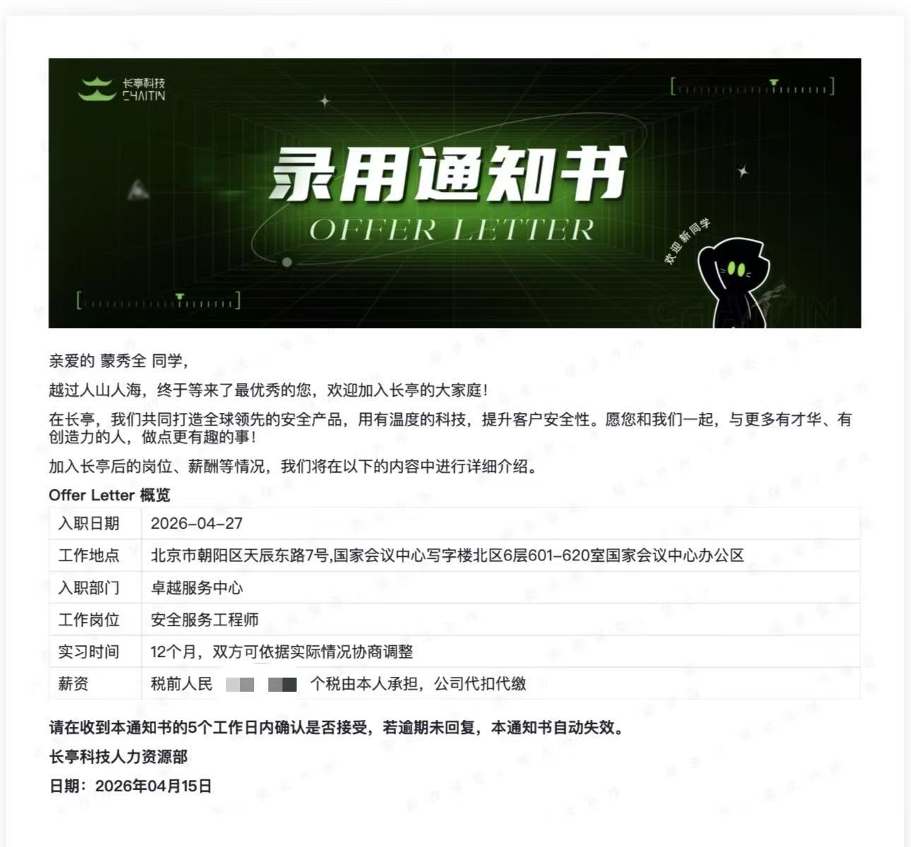

# 到北京儿了

## 5月2日第一顿饭+租房

把学校的事情处理好之后，赶忙定了2号的机票就飞了过来，哎当时还是大意了，定的早上八点的机票，想着自己通个宵没啥问题，结果那天晚上简直是煎熬，先前看到附近的酒店才不到一百块钱，后面也没定，还是太相信自己了

到包师傅出租屋已经是中午十二点多一点了，洗了个澡后也是被这个bitch请了一顿贵州酸汤火锅，不得不说第一次吃酸汤火锅，真的夯爆了

又大意了，当时到北京的时候北京满天柳絮飘飘，我们坐在靠近门的一桌，结果吃饭时候时不时飘来柳絮，掉进汤里面的其实也数不胜数了

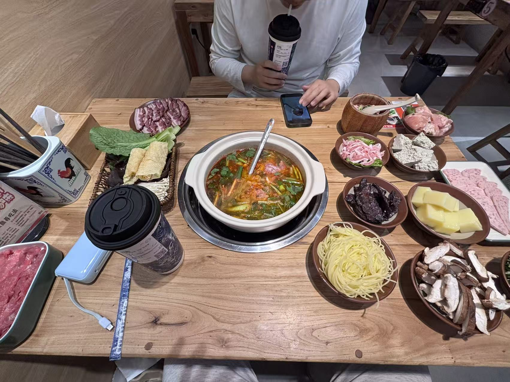

吃完饭后包师傅陪着我去看房子，很不巧的是还下了小雨，两个年轻的小中介骑车带着我们两个在不同小区里冒雨看房

当时看上了两套房子，不过第一套房东只让短租两个月，无奈之下只能放弃了，选择了第二套

选好后就是搬行李+买生活用品了，花了百来块大洋

最终的小屋：

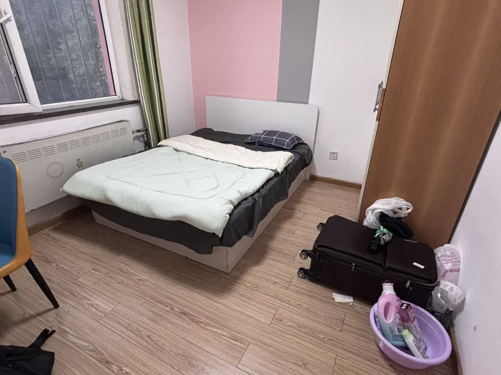

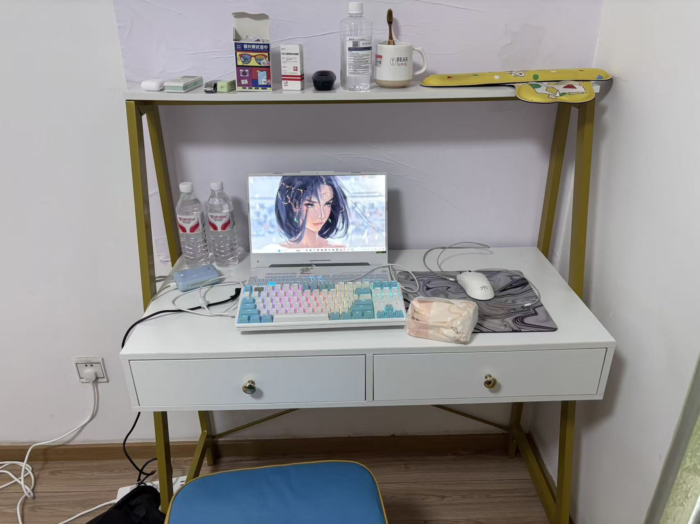

倒也像个小家了

## 5月3日天坛公园

有两位高中同学来北京看无畏契约的比赛，所以顺道找我一起出来逛，就定在了天坛公园

3号的天不同于2号，一下就变热起来了，而且天坛公园人巨多

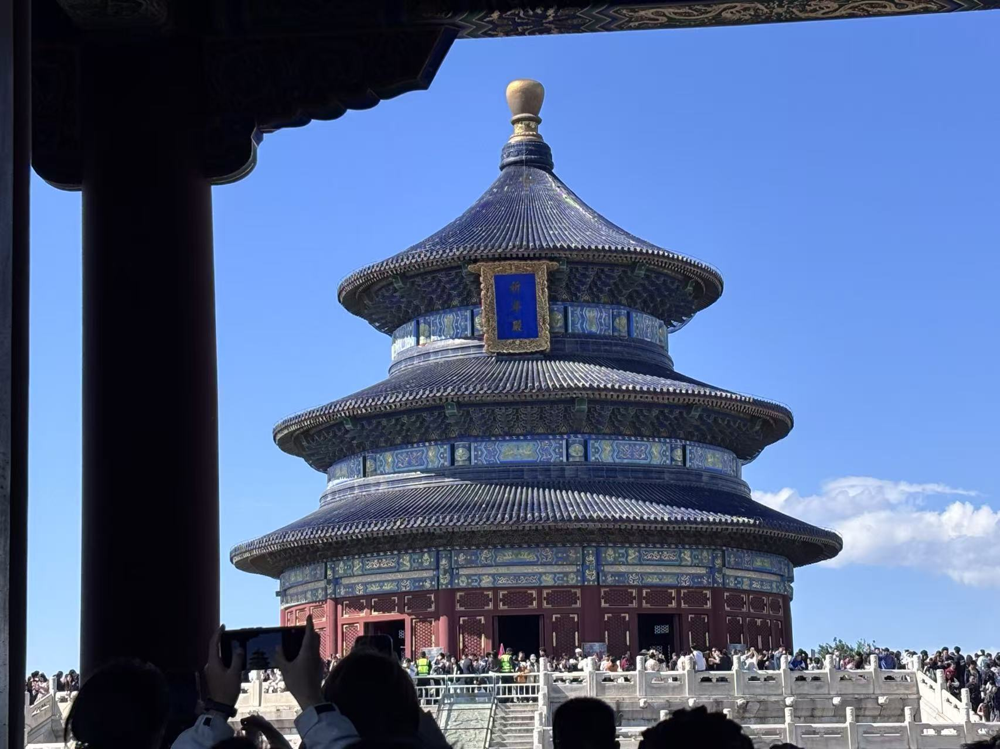

关于为什么说人很多。。。：

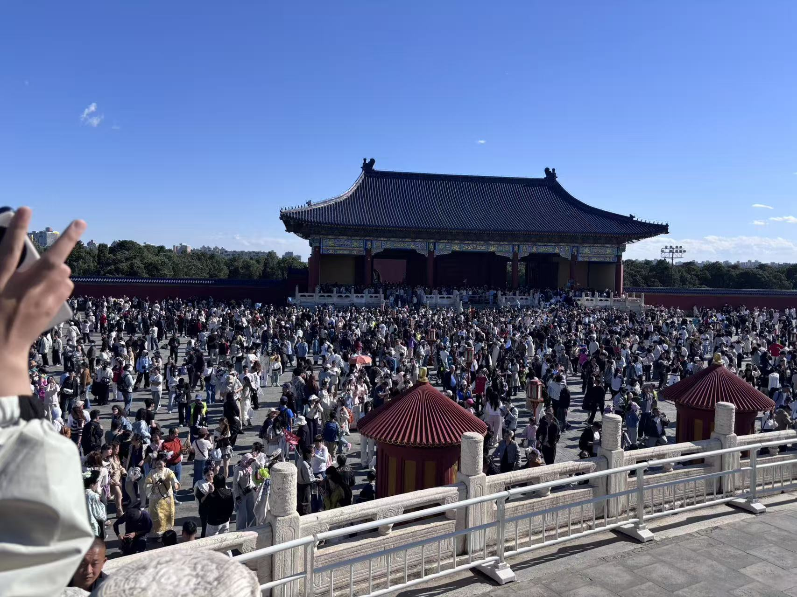

晚上吃了一顿垂涎已久的铜锅涮肉，依旧是聚宝源

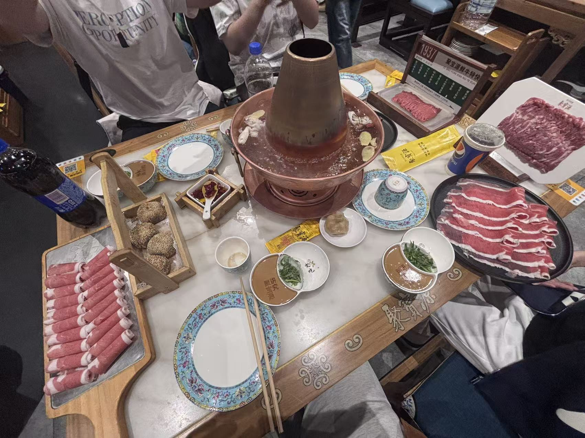

不知道是不是我记错了，聚宝源加一份麻酱还要收费了？？？而且还是七块钱一份

## 5月4日颐和园

朱师傅入职了ks，也是在北京，于是两人就约着去逛公园，最终选定了颐和园

花了40大洋坐了游船到景区对岸，湖面上风吹的特别舒服，很安逸

颐和园的人还是蛮多的，如果不是颐和园离出租屋很远，我倒是想着以后多来逛逛，门票也不是很贵哈哈哈哈

本来晚上喊了包师傅一起来合生汇和朱师傅吃饭，结果这小子去洗牙，洗完回来跟我说蒙师傅要死了（洗牙的一点副作用？哈哈哈哈哈哈笑死我了

然后晚上跟朱师傅逛了一下合生汇，狠狠安利了一家之前来北京吃了几次的王繁星面馆，是一家上海本帮面面馆

真的很好吃，就是有点小贵

漂亮饭be like：

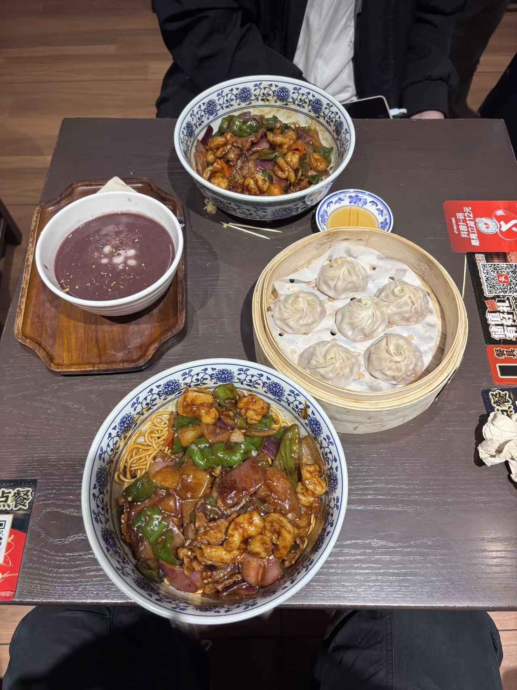

## 5月5日庆祝入职

因为6号入职嘛所以5号包师傅约着说吃顿饭庆祝入职，思来想去，该吃什么呢。。。烤肉！北京有一种炙子烤肉，就类似于铁板烤肉吧，也挺好吃的，听说刘记的很好吃，但是离我和包师傅这边都很远，最终选了一家明星探过的一家烤肉叫：烤肉刘·清真·老北京炙子烤肉

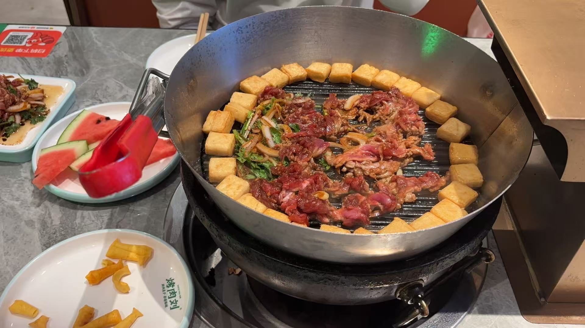

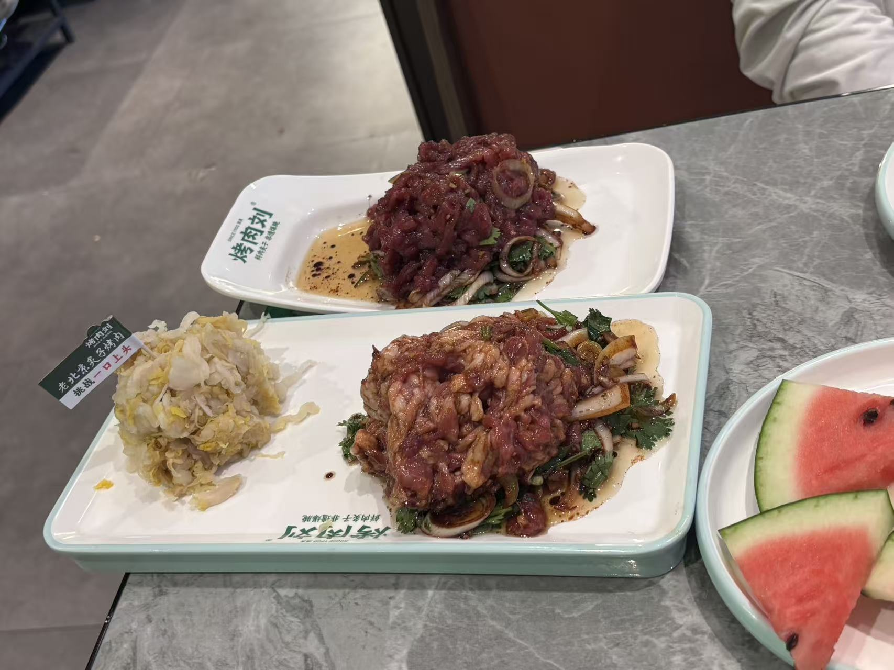

不得不说每一份肉都很多，因为是请包师傅吃的这顿，后面又点了一份薄荷牛肉给包师傅吃，给他吃撑了都哈哈哈哈哈

可恶，还没玩够就要入职了！！！呃啊！不甘心的进入了梦乡

# 5月6号入职

早上入职会有一个培训，hrssc讲了很多入职的相关事宜，待遇方面的，然后就是技术师傅讲解如何配置公司发的电脑

以为每个人都会是mac，结果居然还有鸡哥，该说不说我之前还信誓旦旦的跟包师傅说我不会抽到air的，结果连mac的边都没沾上哈哈哈哈

快到十二点了才培训完，本来以为会很快培训好的，就没打算吃早饭，这下好了，给孩子饿成啥了

碰巧周三是大餐日，有很多好吃的

在公司的第一顿午饭

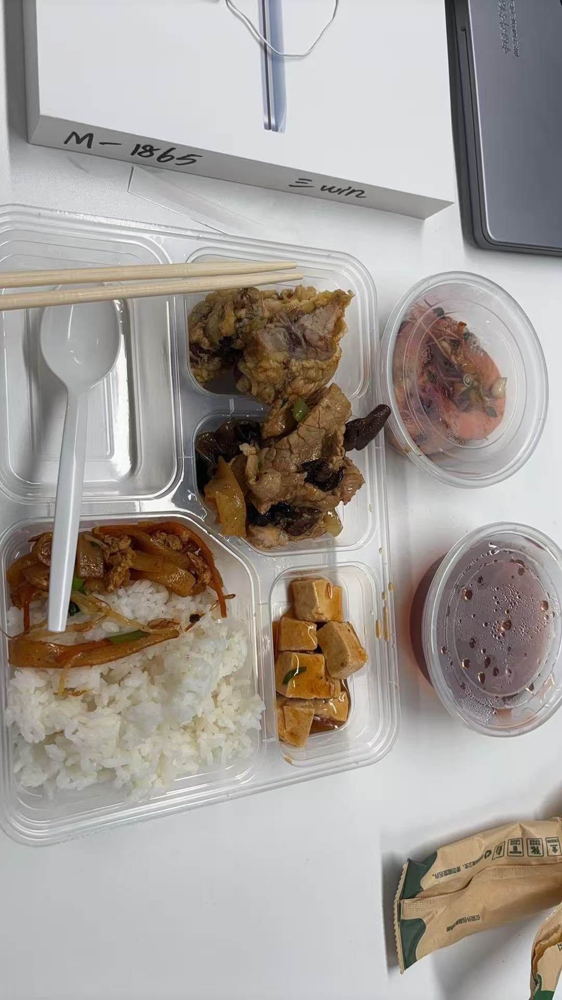

吃完后一直在配环境！！！新电脑配环境真的好恼火，很多配置的方法都得现搜，还不一定搜的到

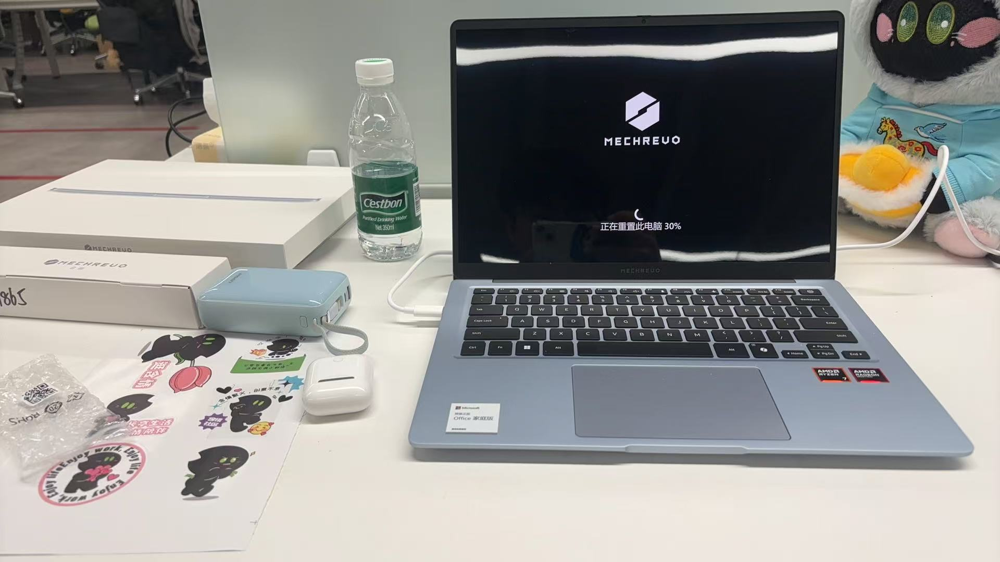

别问我为什么重置电脑，因为我不小心把用户名写成了中文名！不过好在是新电脑，也不算麻烦

中午包师傅喊上我一起去附近瑞幸买咖啡，大抵是太久没摸鱼了，竟有点慌乱哈哈哈

其实感觉在公司的学习状态挺好的，能沉下心来去做事情，太久没有回归这种状态了唉

六点半准时下班！下班后跑去蔬菜超市买了晚上要做的吃的

奈何经验太少，面对这么多的东西竟有些不知所措，最终只买了一袋饺子，酱油和食用油

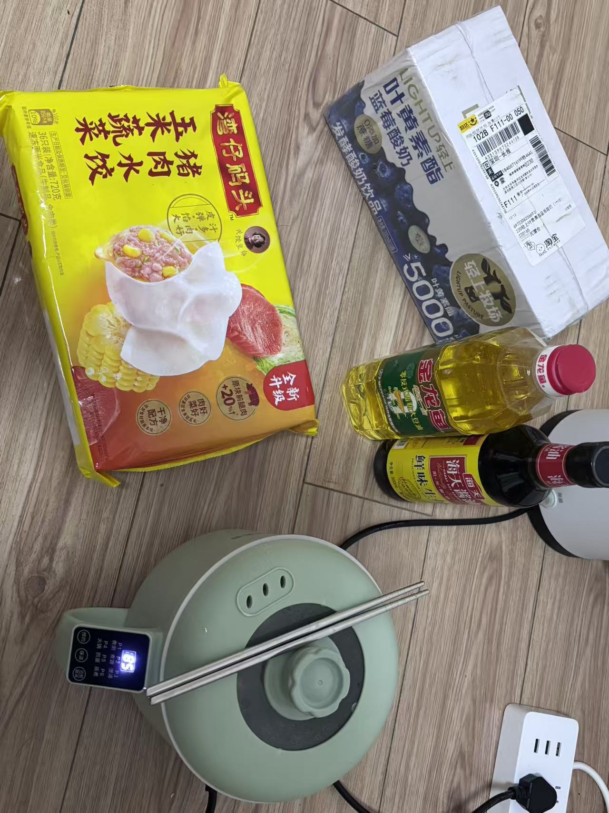

吃了9个饺子，本来以为够了，结果很快就开始饿了，硬是撑到了第二天吃早餐，又一次高估自己了

最后分享一波下班后拍到的夕阳：

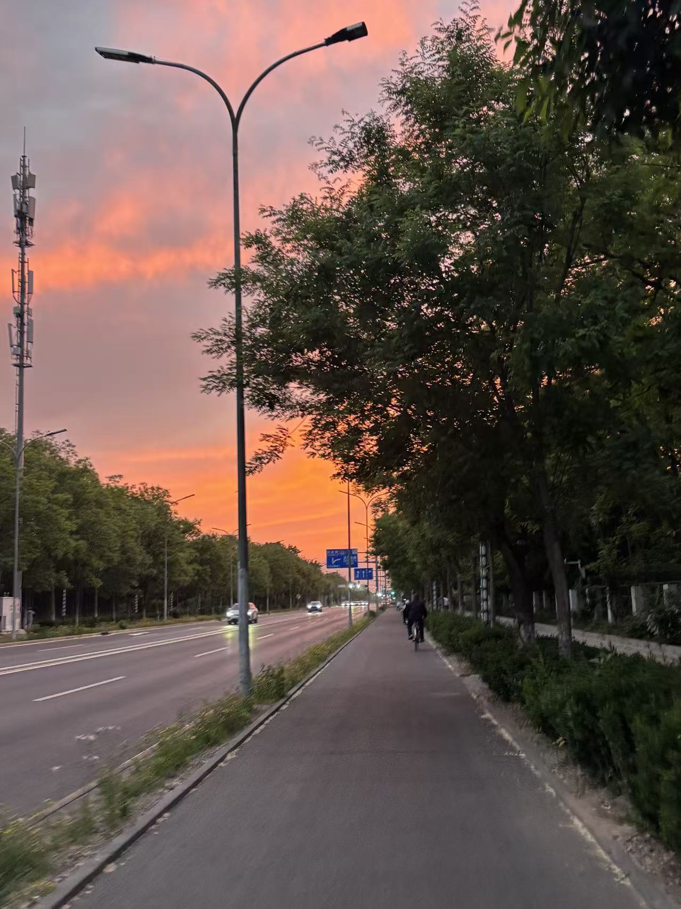

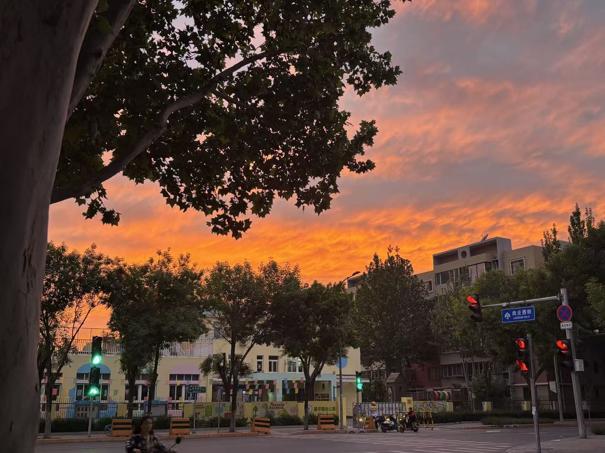

记录生活才有意义！

# 5月7号

这几天要测一波题，今天让codex筛选出来大概有三百多道，看完天都塌了

没事，当作学习做题的过程了

因为早上还没给权限，所以其实是下午才开始测的题，由于不太熟悉一些业务流程，和业务的姐姐交流了好久，业务的姐姐人也很耐心一直在给我讲该怎么做，太感动了！本质上我也是属于那种一定要确保自己确实搜不到找不到确实不会才会去问的人，中间花了很多时间去熟悉这个业务，所以今天最后测的题目也不多，不过也算是学到了一些东西的

没想到！坐在我对面的同事太卷了！这两天每天测了三十多四十道题，看着我填入日报的个位数的题数，我陷入了沉思，不行！我明天要狠狠的测题！！！

包师傅真是个bitch，入职的时候自我介绍拿了我的证件照，今天hrssc催我交自我介绍，真是太为难我这个很少拍生活照的人了，翻了好久的相册，最终选择了一张跟之前包师傅交的那张底色不同的证件照...

# 5月8-9号

这两天也是疯狂测题，token和经费在疯狂的燃烧！！！

唉，赶上五一入职了，9号周六调休加班，没招了

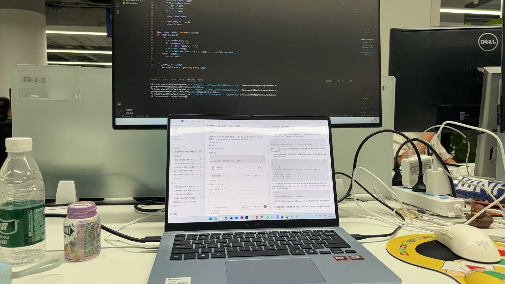

没想到！9号晚上我走进了家附近地铁站一家豌杂面，本来以为会是bj经典的商业诈骗，却没想到味道如此之好

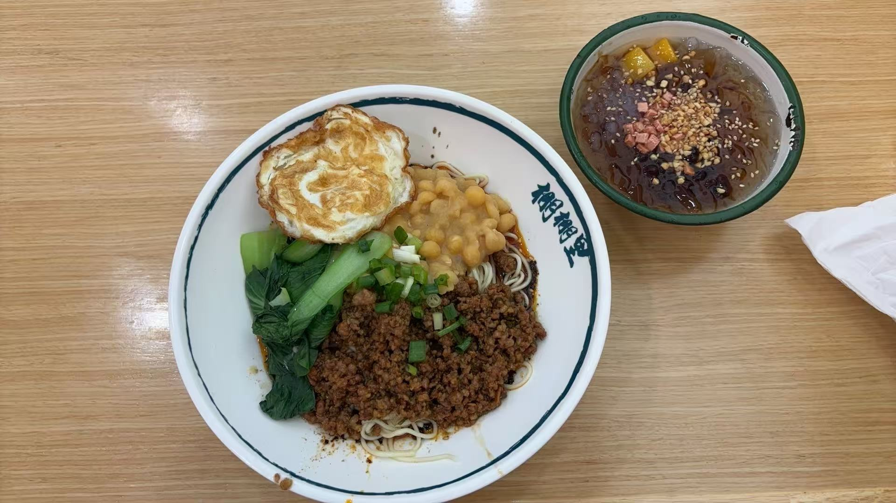

师傅们可以猜猜价格哈哈哈哈

# 5月10号龙哥豪请涮肉

今天ACTF开赛，早早起床准备打比赛，结果还是被AI创死了，web2开打没多久就出了，然后我也让ai梭出来了，ai写了份wp我还看了一下，没想到很复杂（反正如果古法做题肯定要做很久对我来说）emmmm不过最后web2出了一百多个解

就打了几个小时，后面实在牢不动了，而且今晚约了方总吃饭，还面基了疏狂哥和龙哥还有一位su的哥哥

龙哥豪请，肉真的点了超级多哈哈哈哈，几个大男人吃的速度也是飞快

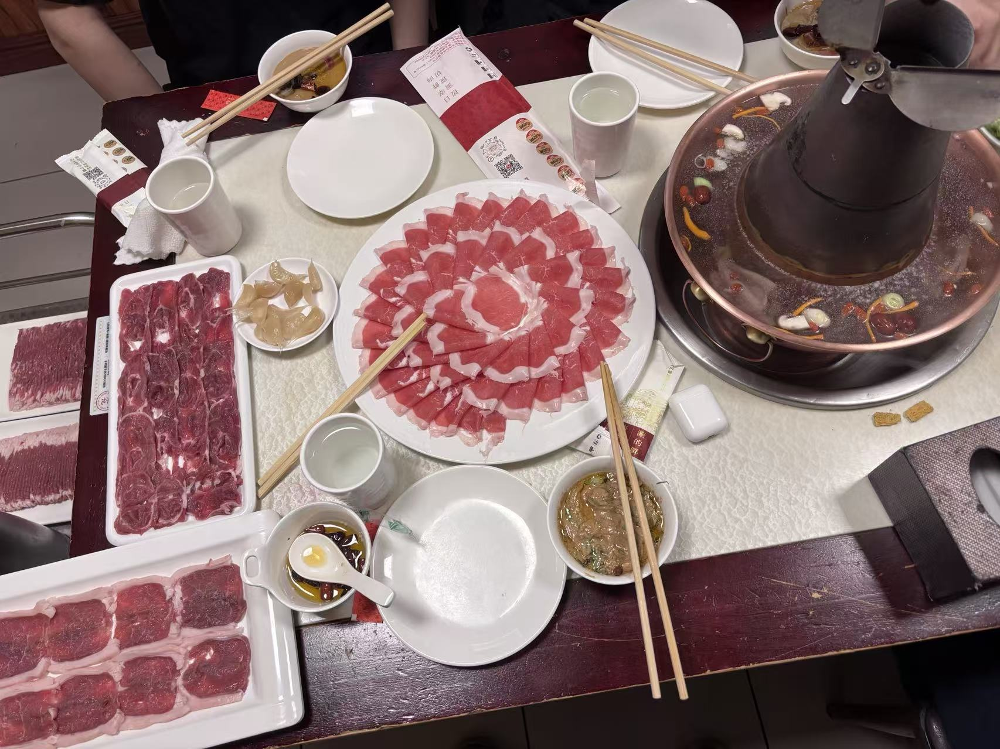

但是餐桌上还挺多川渝的朋友，铜锅涮肉对他们来说太清淡了哈哈哈哈哈，这就不得不提到我这种啥都能接受的体质了

# 5月13号

今天周三，是大餐日，菜品真的很赞

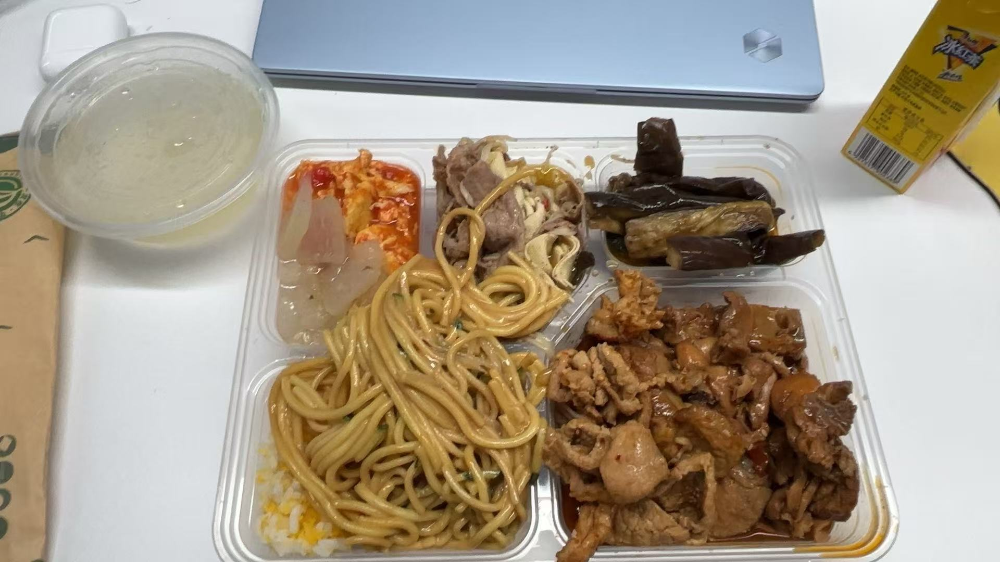

晚上包师傅带着我去购物了一波，主要还是买些晚上做的吃的

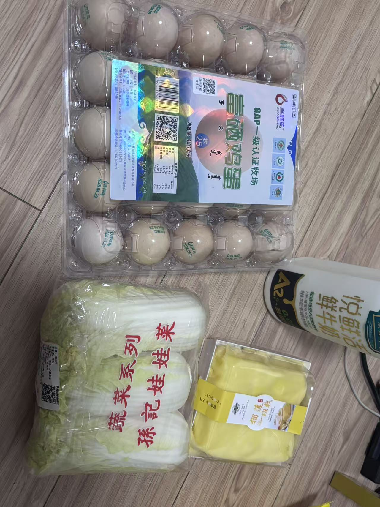

加上包师傅给我的饺子和面

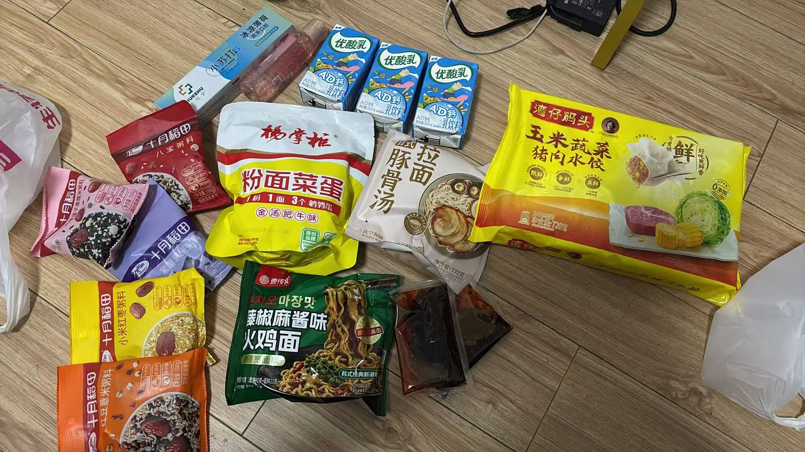

感觉够活一阵子了

# 5月15号聂师傅豪请

聂师傅豪请313羊庄，爽吃了烤羊腿和羊肉汤

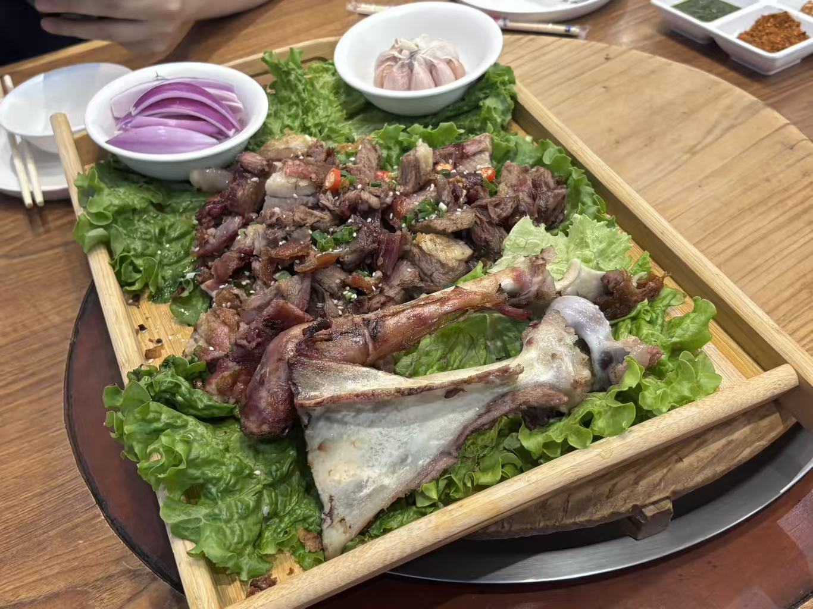

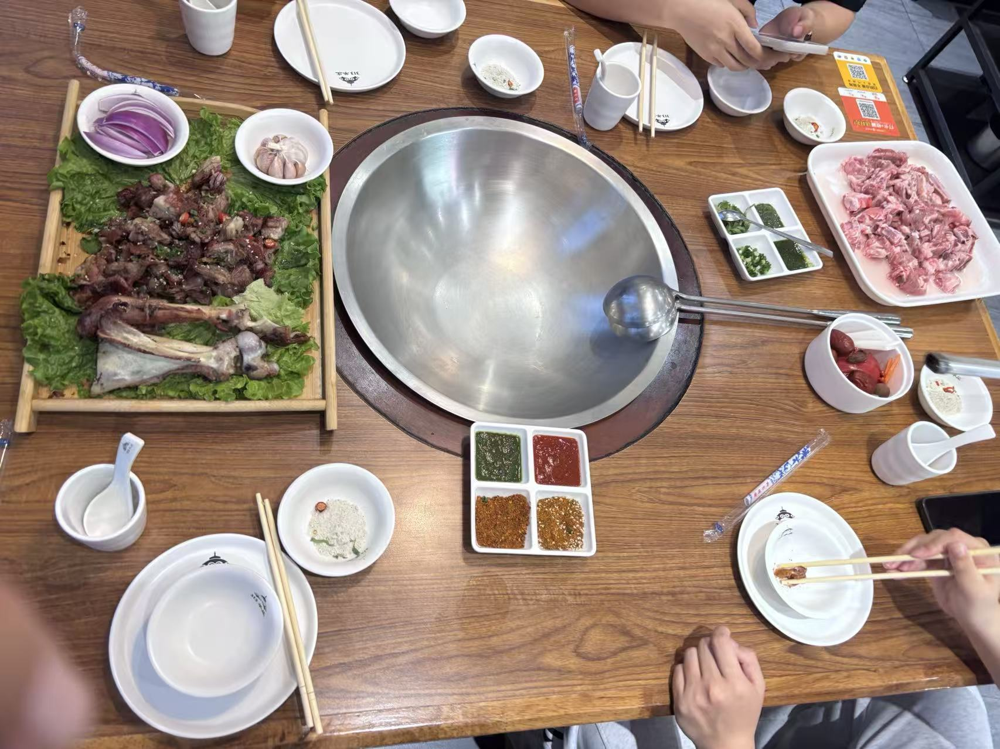

聂师傅一开始问我吃不吃羊鞭，我以为羊鞭就是羊的尾巴，想都没想就同意了，结果是。。。不过不得不说也算是补补身子了